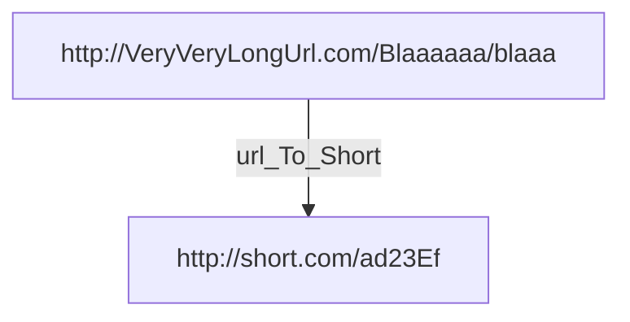

최근 **군복무를 마치고** 현재는 평범한 공대생 신분이다.  

전공 공부 만으론 나의 욕구를 채워주지 못해,  
(!= 학교 수업이 나쁘다)  
**(== 나의 열정은 교수님도 못 말린다)**  

**토이 프로젝트**를 꾸준히 진행 해 보기로 했다. 

사실 대학 복학 후 스프링 처음 공부 한답시고 이미 했던 프로젝트가 있긴하지만
private한 Repository라 공개하지 못하는 아쉬움이 ㅠㅠ

__

# [1] 기획
## 1) 기획(?) 시작

나는 기획자도 아니고 디자이너도 아니다.  
그리고 여러명이서 작업하는 것도 아니다.  
애초에 창업을 목적으로 서비스를 구축하는게 아닌,  
그냥 단순히 내 사리사욕을 채우기 위함이 크다.  

그렇기 때문에 이러한 부분들을 대충 대충 진행 했다.  

최근에 url 단축 서비스를 내가 직접 만들어 보면 어떨까?  
라는 생각이 있었기 때문에  
url 단축 서비스를 만들어 보기로 했다.  

## 2) 기존 서비스 분석

- shorturl.at/xBCP6  
- url.kr/d7l93k  
- asq.kr/?i=y200gjmaBOL  
- me2.kr/d9ur6  
- c11.kr/xwzl  

다음은 모두 github.io를 가리키는 shortUrl이다.

>**{HOST} 뒤에 4~5자의 영어+숫자로 줄여지는게 대부분이였다.**

영어 알파벳(대소문자)가 52개고, 숫자 [0..9]가 10개니깐 **총 62개**다.
즉 위 같은 단축 url들은 특별한 로직이 있지않는 한, 표현 할 수있는 url이 62의 거듭제곱 꼴인것이다.

예로 **me2.kr/d9ur6**에선 *{HOST}* 뒤에 **5자로 Url을 표현**한 것이니깐
**62의 5거듭제곱**, 즉 916,132,832개 까지 표현 할 수 있다는 것이다.

물론 약 10억에 달하는 큰 수지만,
10억개 이상의 url이 쌓인다면 어쩔 수 없이 *{HOST}* 뒤에 표현하는 데이터가
6자 이상으로 길어 질 수 밖에 없다는 것이다.

## 3) 방향성 정하기

저는 여기서 문득 이런 생각을 해봤습니다.
>기존 url 단축 서비스에서 **알파벳, 숫자** 말고 **한글**로 표현 해보면 어떨까?
>>한글은 **꿹꼽끩꾫** 이런 글자들이 많아서 짧은 글자 수로 많은 데이터를 표현 할 수 있지 않을까?
>>>검색해보니 U+AC00 구역 에 11172**음절**이 있다고 함.
>>>>**즉 한글 한글자로 나타 낼수 있는게 글자가 약 1만개라는 뜻**

	
실은 url에 한글이 포함된다는게 문제가 좀 많습니다.

* 보통 SNS등등에서 url을 판단할때 한글은 필터링 값에 들어가있지도 않은 경우도 많다.
*(=신나는 마음으로 짧은 url을 넣었지만 다른 사용자들은 하이퍼링크가 아니라 **접근을 못함**)*
* **비 한국어권 환경**에서는 **url이 깨지**거나, **encode가 되어 url이 길어짐** 
* 여기서 설상가상으로 한글 도메인 *(ex. 안녕.한국)* 까지 써버리면 퓨니코드 인코딩으로 **url이 더 길어짐** 

그럼에도 불구하고
한글 몇글자로 무한대에 가까운 url들을 다 표현 할 수 있다는 것에 흥미를 느껴 개발하기로 했습니다.

## 4) ERD

--
