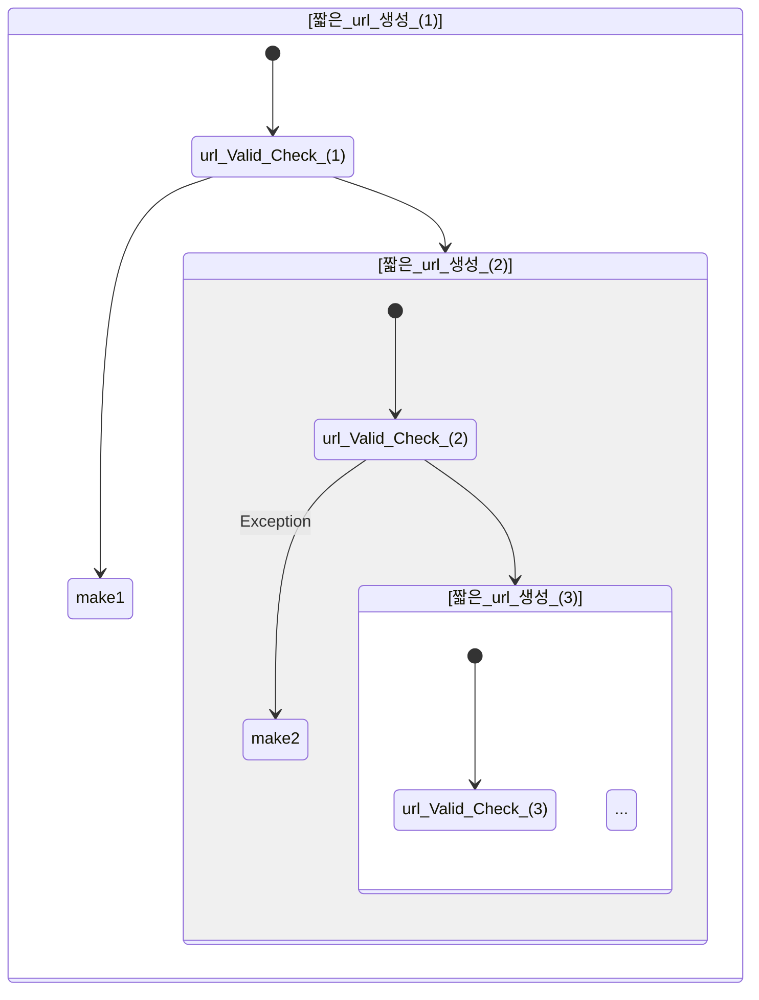

# [2] 개발

보통은 front와 Back을 분리하는게 이상적이겠지만,
혼자 개발하는거다보니 시간적인 문제로 쉽지가 않았다.
~~(따로 진행하는 프로젝트도 있기 때문에....)~~

백엔드는 이제 막 공부 시작한 **자바 스프링부트 프레임워크**를 쓰기로 했고,
페이지 렌더링은 __간단하게__ 타임리프를 써서 Server단에서 랜더링 해주기로 했다 **(SSR)**.
실제로 코드보면 프론트 부분은 "음... 돌아가긴 하네?" 느낌이 들것이다.

## 1) 간단히 기능 명시
- Client
	- 메인 페이지 (기능 소개, 짧은 url 만들기 기능, dashbaord 바로가기 기능)
	- 대시보드 페이지 (짧게 만든 url에 대한 접속자 statistics 제공)
		- 차트형태로 데이터 가공 후 제공
	- Server와 통신은 Jquery Ajax로 호출
- Server
	- 페이지를 랜더링해서 클라이언트에게 보내줌(타임리프를 통한 SSR구성)
	- 한글과 데이터의 1대1 매칭 _[2]-3 참고_
	- 짧게 만들어진 url을 origin url로 redirect
		- 접속 과정에서 접속자 정보 Logging
			- Logging할 정보는 OS, Browser, Referer, 접속 시간
		
간단히 이정도만 명시해두고 개발에 진행했다.

## 2) 코드 : [Github](https://github.com/PENEKhun/shortUrl)

## 3) 한글과 데이터의 1대1 매칭
일단 한글은 초성 중성 종성으로 이루어져있다.

초성 중성 종성을 한글자로 만드려면
다음과 같이 할 수 있다.

```java
int chosung; //초성 (0~18)
int jungsung; //중성 (0~20)
int jongsung; //종성 (0~27)
char unicode = (char) (44032 + (chosung*21*28) + (jungsung * 28) + jongsung);
```

여기서 초성으로 올 수 있는 수는 0~18
중성은 0~20, 종성은 0~27이다.

우리가 초성 + 중성 + 종성으로 표현 할 수 있는 경우의 수는
19 * 21 * 28 = 11172이다.

예를들어서
만약에 숫자 0을 넣으면 '**가**'가 추출되고
숫자 18를 넣으먄 '**하**'가 추출되고....
중요한건 **0**부터 **11172**까지의 입력에서
**중복**으로 **추출되는 한글**이 **없어야** 한다.


저는 이러한 문제를 **진수**로 해결 했다.

숫자 1을 넣으면

| 초성(0~18) | 중성(0~20) | 종성(0~27) |
|------|------|------|
|1      |      |      |
```java
int chosung = 1; // 초성
int jungsung = 0; // 중성
int jongsung = 0; //종성
char unicode = (char) (44032 + (chosung*21*28) + (jungsung * 28) + jongsung);
```
>result = 까

숫자 18을 넣으면

| 초성(0~18) | 중성(0~20) | 종성(0~27) |
|------|------|------|
|18      |      |      |
```java
int chosung = 18; // 초성
int jungsung = 0; // 중성
int jongsung = 0; //종성
char unicode = (char) (44032 + (chosung*21*28) + (jungsung * 28) + jongsung);
```
>result = 하

만약의 19가 입력되면 어떨까?

| 초성(0~18) | 중성(0~20) | 종성(0~27) |
|------|------|------|
|19      |      |      |

초성은 0~18까지의 수만 가질 수 있기 때문에
다음 처럼 처리 해준다.

| 초성(0~18) | 중성(0~20) | 종성(0~27) |
|------|------|------|
|0      |1      |      |

```java
int chosung = 0; // 초성
int jungsung = 1; // 중성
int jongsung = 0; //종성
char unicode = (char) (44032 + (chosung*21*28) + (jungsung * 28) + jongsung);
```
>result = 개


## 4) Security와 예외 핸들링
### (1) 무차별 적으로 만들어내는 짧은 Url에 대한 대응
일단 1차적으로 [Google Recaptcha v3](https://developers.google.com/recaptcha/docs/v3) 를 사용하고 있지만,  
봇이 아닌 사용자가 직접 만들어 내는 (**일명 광클**) 행위는 서버 자체 방화벽 rule적용으로 막으면 될 것이다.

### (2) Sql injection에 대해
mysql에 접속하는 부분이 링크 만들기, 링크 접속, 대시보드 이 3가지 밖에 없는데  
JPA에서 지원하는 Parameter Binding를 통해 해소 할 수 있었다.


### (4) 서비스가 스미싱에 악용되는 경우
짧은 url을 만들때 입력받은 Url의 유효성을 검증하기 위해 서버단에서 접속을 해봅니다. 해당 url이 다른 호스트로 리다이렉션 되는 경우, 스미싱등 안좋은 쪽으로 이용될 가능성이 높다고 판단하여 이 부분을 예외 처리 했습니다.


### (5) api로 리다이렉션되는 url을 입력받을 경우

(4)에서 언급했듯 Url의 휴효성을 검증하기 위해 서버단에서 접속을 해봅니다.  
하지만 **입력 받은 Url**이 **해당 서비스**의 **짧은 url 생성 API** 로 **리다이렉션** 된다면,

다음과 같이 **무한루프**에 빠질 가능성도 있고,  
[Google Recaptcha v3](https://developers.google.com/recaptcha/docs/v3) 가 우회된다면 무차별적으로 url을 생성될 가능성도 있습니다.  

이러한 이유로 본 서비스 URL의 입력을 Exception처리 하였습니다. (이를 타사 short Url서비스 등을 이용해서 우회하려고 하면  *4) 서비스가 스미싱에 악용되는 경우*에 필터링 됩니다. )


__

# [3] 배포

## 서버 구성
- aws ec2 무료 인스턴스로 구성하였다.  
  - ubuntu 버전 아무거나 상관없다.  
    - jdk만 설치할 수 있으면 된다!  

### WAF
[앞서 언급한 문제점](#1-무차별-적으로-만들어내는-짧은-url에-대한-대응)을 해결하기 위하여 WAF를 구성하려고 하였으나,
서버 장비와 자금이 녹녹치 않아 구성하지 못하였다.  
다음에 접목시킬 프로젝트가 있다면 꼭 도입해 봐야겠다.


## 직접 수동으로 배포하자!
github -> travis ci  -> aws S3 -> CodeDeploy -> __SERVER__

이런식으로 하려고 했으나,,,, 배보다 배꼽이 더 큰듯 하여
구석기 시대(?) 방식으로 하였다.

```bash
tar -cvf server.tar {프로젝트 폴더}
scp -i {서버 pem 파일} -r ./server.tar {서버 계정}@{서버 아이피}:~/
ssh  -i {서버 pem 파일} {서버 계정}@{서버 아이피}
```


# [4] 느낀점 
아무래도 자바와 스프링부트를 공부하고 처음 제대로(?) 해보는 프로젝트라 놓치는 부분들이 많았다.   
비록 작은 프로젝트지만, 이 기간동안 다른 유저들이 실제로 내 서비스를 사용하는 상상을 하며 즐겁게 만들었던것 같다.

CI/CD구성을 안하고 수동 배포를 하고, WAF도 도입못한지라 상당히 아쉽다.
하지만 다음에는 이러한 부분들을 보완하여 더 질 좋은 프로젝트를 진행해보고 싶다.


# [5] 라이센스 
  * Bootstrap v5.1.3 (https://getbootstrap.com/)
  * Copyright 2011-2021 The Bootstrap Authors (https://github.com/twbs/bootstrap/graphs/contributors)
  * Licensed under MIT (https://github.com/twbs/bootstrap/blob/main/LICENSE)

This Repository includes GeoLite2 data created by MaxMind, available from <a href="https://www.maxmind.com">https://www.maxmind.com</a>.

