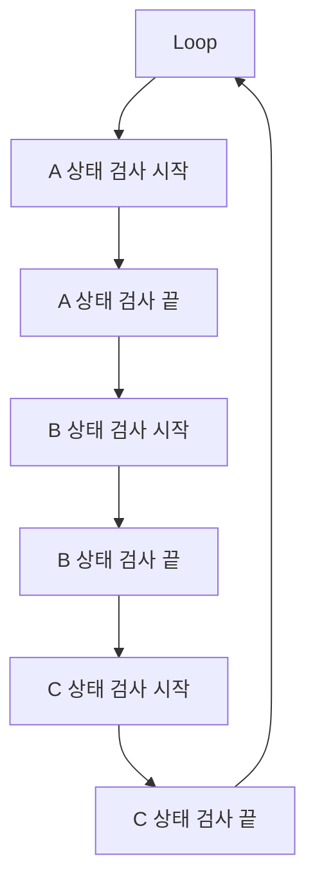
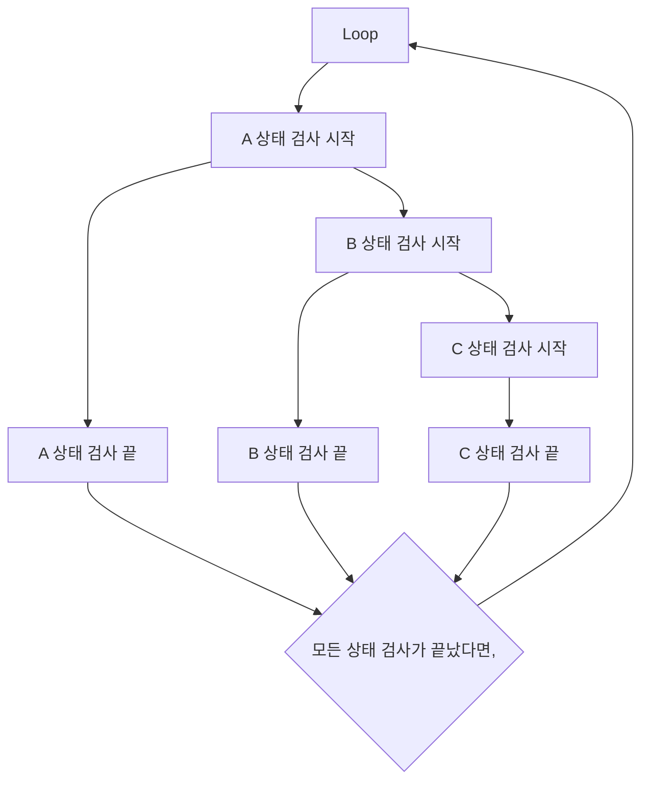

# 들어가기 앞서
**본 게시물은 프리랜서 활동을 통해 개발한 타사의 실제 서비스중인 소프트웨어를 언급하므로 도메인 요구사항, 코드의 일부는 생략(혹은 삭제) 되서 작성되었음을 알려드립니다.**

# 본론
## 발생 상황
프리랜서로써 Chrome Extension + Backend 개발을 하다가 발생한 일이다.  
도메인 요구사항이 다음과 같았다.  
1. 하나의 Row가 Insert될때 해당 Row의 특정 Column값은 유동적이다.
	1.  그 유동적인 Column값은 3개의 다른 테이블에서 각자 Select를 하여 정한다. 
2. 보통 1회 요청시 수백번의 Select, Insert문이 실행된다.


### 초기 작성 코드
그래서 작성한 코드가 다음과 같다.

```java
// 중복 검사  
// A 상태 검사  
Optional<WorkHistoryEntity> keywordChk2 = workHistoryRepository.findByMobileAndTaobaoProductId(account.getUsername(), productItem.getCode());
keywordChk2.ifPresent(keywordEntity -> {  
    item.setOverGubun('A');
});
  
// B 상태 검사  
Optional<ScrapGoodsEntity> keywordChk1 = scrapGoodsListRepository.findByMemberIdAndProdCode(account.getUsername(), productItem.getCode());
keywordChk1.ifPresent(keywordEntity -> {  
    item.setOverGubun('B');
});
    

// C 상태 검사
Optional<ProductEntity> keywordChk3 = productRepository.findByMemberIdAndCode(account.getUsername(), productItem.getCode());
keywordChk3.ifPresent(keywordEntity -> {  
    item.setOverGubun('C');
});
```


하지만 한번 API요청을 할때 마다 Response속도가 너무 느렸다.  
파악해본 문제점은 다음과 같았다.  
1. 하나하나 쿼리가 너무 느림.
2. 쿼리가 실행될때 Blocking되어 다른 작업을 못함.

이러한 이유에서 비동기를 사용해야겠다고 마음먹었다.

### 동기 VS 비동기
#### 동기
동기는 **직렬적**으로 작동하는 방식이므로, 코드 한줄이 끝나야 다음 라인이 실행된다.  따라서 이를 다음과 같은 FlowChart로 표현할 수 있다.  

A 상태 검사가 시작하면 끝이 날때 까지 다음 테스크로 진행하지 못한다.  
즉 A 상태 검사를 위해 호출한 함수(callee)가 return되기 까지 caller에게 제어권을 돌려주지 않는다. 우리는 이것을 **Blocking**이라고 칭한다.  
이는 상당히 자원을 비효율적으로 사용한다는 것을 의미한다.  

#### 비동기
비동기는 동기와 달리 **병렬적**으로 작동한다.  
즉, 비동기는 특정 코드가 끝날때 까지 코드의 실행을 멈추지 않고 다음 코드를 먼저 실행하는 것을 의미한다.  

비동기를 이용하면 다음과 같은 Task로 바꿀 수 있다.  

물론 이해를 위해 간단히 그려본 FlowChart이므로 스레드가 생성되고, context-switching되는 행위들이 생략되었다.  

## 수정 코드
- 일단 트랜잭션을 읽기모드로 하여 쿼리 속도를 향상 시켰다.
- FindBy대신 ExistsBy를 사용하여 쿼리 속도를 향상 시켰다.
- 더불어 아까 언급했던 CompletableFuture를 사용하여 비동기를 구현하였다.
```java
@Transactional(readOnly = true)  
public CompletableFuture<FinderSchGoodsList> chkDup(String key, Account account, ProductItem productItem) {  
    return CompletableFuture.supplyAsync(() -> {  
        FinderSchGoodsList item = FinderSchGoodsList.builder()  
                .key(key)  
                .memberId(account.getUsername())  
                .name(productItem.getName())  
                .code(productItem.getCode())  
                .url(productItem.getUrl())  
                .img(productItem.getImage())  
                .price(productItem.getPrice())  
                .salePrice(productItem.getSalePrice())  
                .overChk("F")  
                .overGubun("F")  
                .build();  
  
        // 중복체크 1
        if  (workHistoryRepository.existsByMobileAndTaobaoProductId(account.getUsername(), productItem.getCode())){  
            item.setOverChk("T");  
            item.setOverGubun("A");  
        }  

        // 중복체크
        if (scrapGoodsListRepository.existsByMemberIdAndProdCode(account.getUsername(), productItem.getCode())){  
            item.setOverChk("T");  
            item.setOverGubun("B");  
        }  
  
        // 중복체크 3 
        if (productRepository.existsByMemberIdAndCode(account.getUsername(), productItem.getCode())) {  
            item.setOverChk("T");  
            item.setOverGubun("C");  
        }  
  
        return item;  
    }, executor);  
}
```

이렇게 구현했더니 최소 5배는 빨라졌다.  
전 코드와 비교했을때 **Better Way**인것 같긴하나, **Best Way**인것 같진 않다.

_많이 수련해야겠다._  

## 아쉬운점
- 3개의 테이블에서 중복 조회하는 쿼리를 한방 쿼리로 만들지 못함.
	- 현재 서비스 환경이 여러개의 DB서버를 이용하기 때문에 한방 쿼리를 하지 못한다. 발주자에게 이러한 부분을 말해보니 어쩔수 없다고 했다.  
- 해당 요구사항에 맞는 좋은 방법(물론 여기선 요구사항이 많이 생략되긴 하였습니다)이 분명 있을텐데, 아직 큰 개선방법을 잘 모르겠다.  
