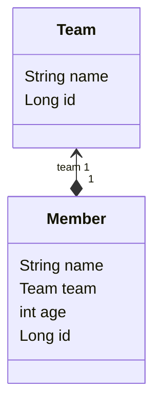

JPA 에서 *연관관계*의 자식 엔티티를 조회할때는 `지연로드`(*LAZY*), `즉시로드`(*EAGER*) 방식이 있다.  
이 글로 지연로드, 즉시로드 그리고 영속성 전이까지 이해하는데 도움이 되었음 한다.


## 로드 방식 지정하는 법
지연로드 방식으로 변경 하려면 다음처럼 `fetch`값을 변경한다.
- FetchType.LAZY : `지연로드`
- FetchType.EAGER : `즉시로드`

```java
@Entity  
public class Member {  
//..
  @ManyToOne(fetch = FetchType.LAZY) // <- 요렇게
  private Team team;
//..
}
```

## 기본 설정값과 이유 추측해보기
명시하지 않았을때 기본 설정 값이다.
- `@OneToMany`, `@ManyToMany` : [지연로드](#지연로드)
- `@OneToOne`, `@ManyToOne` : [즉시로드](#즉시로드)

왜 이런 식으로 기본값이 설정되어 있을까?  
다음과 같은 `~ToMany` 참조를 많이 하고 있는 **사용자** 테이블이 있다 해보자.
{:width="600px"}  

사용자를 조회한다고 하면, **상품**, **주문**, **배송**, **판매자** 등 여러 정보를 다수 조회된다.  
조회될 양은 *참조 depth를 타고 들어갈수록* $n \times m ... \times ... l$ 식으로 *엄청 커질 것이다.*  
따라서 애플리케이션의 부담을 덜기 위해 `~ToMany`*(:M)* 관계는 [지연로드](#지연로드) 기본 값이다.  
  
반면 `~ToOne`(:1) 관계는 비교적 부담이 덜 하다. 따라서 [즉시로드](#즉시로드)가 기본 값이다.  
 
## 본격, 들어가기 앞서
해당 글에서는 코드를 가지고 설명을 이어갈 것인데,
이를 위해 공통으로 사용할 엔티티 도메인에 대해 간략히 설명하겠다.

```java
@Entity  
public class Member {  
//..
  @ManyToOne(fetch = FetchType.LAZY)
  private Team team;
//..
}
```

```java
@Entity
public class Team {  
//..  
  private String name;
}
```

간단하게 다이어그램으로 표현해보면 다음과 같다.

### Tip
저자는 모든 연관관계를 [지연로드](#지연로드)로 설정하고, 필요에 따라 [즉시로드](#즉시로드)로 변경해서 사용하라 당부한다.
## #지연로드
`지연로드`는 값을 실제로 필요로 할때 조회가 이뤄지는 것이다. 
### 지연로드가 필요한 이유
멤버의 나이만 출력하는 코드가 있다.
```java
Member member = entityManager.find(Member.class, 1L);  
System.out.println("멤버의 나이 : " + member.getAge());
```

*즉시로드라 가정하고* 코드를 실행해보면 :
```sql
Hibernate: select m1_0.id,m1_0.age,m1_0.name,t1_0.id,t1_0.name from member m1_0 left join team t1_0 on t1_0.id=m1_0.team_id where m1_0.id=?
멤버의 나이 : 25
```

우리가 활용하지도 않을 **Team**까지 *join*되어 한방 쿼리가 나가게된다.
이게 연관관계가 Team 하나라 다행이지, 수백개의 연관관계가 있다면 **상당히 비 효율적**일 것이다.

*지연로드*라 가정하고, 실행하면 :
```sql
Hibernate: select m1_0.id,m1_0.age,m1_0.name,m1_0.team_id from member m1_0 where m1_0.id=?
멤버의 나이 : 25
```

이렇게 *join없이* 단순한 쿼리만 나간다.
### 눈으로 지연로드를 확인해보자
이러한 *엔티티 도메인*에서 *PK*가 1인 **Member**를 조회하면, 소스코드는 아래와 같다.

```java
Member member1 = entityManager.find(Member.class, 1L);  
System.out.println("사람 이름을 출력합니다. -> " + member1.getName());  
System.out.println("팀 이름을 출력합니다. -> " + member1.getTeam().getName());
```

**출력된 결과**를 확인하면 아래와 같다.

```sql
Hibernate: select m1_0.id,m1_0.age,m1_0.name,m1_0.team_id from member m1_0 where m1_0.id=?
사람 이름을 출력합니다. -> 1번 타자 홍길동
Hibernate: select t1_0.id,t1_0.name from team t1_0 where t1_0.id=?
팀 이름을 출력합니다. -> LG Twins
```

*여기서 눈 여겨볼 포인트는...*

- 처음부터 Member 접근할때 Team까지 조회하지 않았다. (_출력된 결과 line 1_)
```sql
Hibernate: select m1_0.id,m1_0.age,m1_0.name,m1_0.team_id from member m1_0 where m1_0.id=?
```

- 실제 **Team** 값을 **Access**하려고 하자, Team조회 쿼리가 나갔다. (_출력된 결과 line 3-4_)
```sql
사람 이름을 출력합니다. -> 1번 타자 홍길동
Hibernate: select t1_0.id,t1_0.name from team t1_0 where t1_0.id=?
팀 이름을 출력합니다. -> LG Twins
```
> member1.getTeam().getName() 이 호출될때 그제서야 쿼리가 나감.

값에 언제 접근할지 어떻게 알고 **지연로드**가 동작하는걸까?
### 지연로드가 동작하는 방식
지연로드가 동작하는 방식을 이해하려면 **프록시패턴** 에 대해 선행되어야 한다.
궁금하다면 필자의 [이전 포스트](/posts/프록시-패턴/)를 참고해보자.  

> 그래서 Proxy, 대리 (???) 로 지연로드를 도대체 어떻게 하는데?

**Member**객체에서 **Team**을 가져오는 `.getTeam()` 호출을 **실제 Member 객체가 아니라**,
**Member 대리 객체에게 요청**하는 것이라 생각해보자.  
그리고 Member 대리객체에서 `.getTeam()` 이 호출될때 일련의 추가 작업을 진행하면 된다.
- 영속성 컨텍스트 초기화 작업
- 실제 쿼리로 조회

실제로 다음 코드를 실행해서, Team의 클래스 명을 보면,
```java
Member member1 = entityManager.find(Member.class, 1L);  
System.out.println(member1.getTeam().getClass().getName());
```

말로만 하면 와닿지 않을 수 있으니, 코드로 이해를 해보자.

다음과 같은 **Member** 객체가 있다.
```java
@Entity  
@Getter @Setter
public class Member {  
  @ManyToOne(fetch = FetchType.LAZY)
  private Team team;
}
```

**Member**의 **Proxy Object**의 코드는 다음처럼 생겼을 것이다.
```java
public class MemberProxy extends Member {
  private Member target = null;

  public Team getTeam(){
    if (target == null) {
      // 초기화 작업
      
    }

    return target.getTeam();
  }
}
```
#### 실제로 프록시 객체가 쓰이는지 어떻게 아나??
단순하게 콘솔에 클래스 이름을 찍어보면 된다.

```java
Member member = entityManager.find(Member.class, 1L);  
String proxyTeamClassName = member.getTeam().getClass().getName();  
System.out.println("proxyTeamClassName = " + proxyTeamClassName);
```

출력 결과:
```
proxyTeamClassName = kr.huni.jpabook.Team$HibernateProxy$IAL7B70F
```

출력된 클래스명을 확인해보면
*kr.huni.jpabook.Team* **\$HibernateProxy\$IAL7B70F**
원래 클래스 이름 뒤에 **구질구질하게** 붙어진걸 볼 수 있다.
실제 객체가 아닌 프록시 객체가 사용된다는 뜻이다.
#### List에선 어떻게 동작하나?
예제코드에서 List<엔티티>를 사용하지 않아서, 다른 예제 코드를 사용했다.
`게시판`-`댓글`을 통해 1:M 연관관계 상황을 가정했다. 

```java
@Entity
public class Board {  
  private Long id;  
  
  private String title;  
  private String content;  
  
  @OneToMany(cascade = CascadeType.PERSIST)
  @JoinColumn(name = "board_id")  
  private Collection<Comment> comments;
  // ...(생략)
  }
```

[여기](#기본-설정값과-이유-추측해보기)에서 언급했듯, `@OneToMany`이기에 자동으로 댓글은 지연로드가 된다.

Comment객체에 접근하는 `board.getComments()`를 호출하면 쿼리가 나갈까?? 한번 실험해보자.

```java
Board board = entityManager.find(Board.class, 1L);  
System.out.println("게시물 제목 : " + board.getTitle());  
System.out.println("댓글 컬렉션 접근 시작");  
board.getComments();  
System.out.println("댓글 컬렉션 접근 끝");
```

실행 결과 :
```sql
Hibernate: select b1_0.id,b1_0.content,b1_0.title from board b1_0 where b1_0.id=?
게시물 제목 : 제목
댓글 컬렉션 접근 시작
댓글 컬렉션 접근 끝
```

하지만, 댓글 조회 쿼리가 나가지 않았다.
바로 다음 코드를 실행해보자.

```java
Board board = entityManager.find(Board.class, 1L);  
System.out.println("게시물 제목 : " + board.getTitle());  
System.out.println("댓글 컬렉션 접근 시작");  
board.getComments().forEach(comment -> {  
  System.out.println("댓글 내용 : " + comment.getContent());  
});  
  
System.out.println("댓글 컬렉션 접근 끝");
```

실행 결과 : 
```sql
Hibernate: select b1_0.id,b1_0.content,b1_0.title from board b1_0 where b1_0.id=?
게시물 제목 : 제목
댓글 컬렉션 접근 시작
Hibernate: select c1_0.board_id,c1_0.id,c1_0.content from comment c1_0 where c1_0.board_id=?
댓글 내용 : 댓글1
댓글 내용 : 댓글2
댓글 내용 : 댓글3
댓글 컬렉션 접근 끝
```

단순 `getComments()`로는 쿼리가 안나가고`getComments().forEach()`, `getComments().size()` 처럼 실제 데이터를 사용하려 할 때 쿼리가 나가는 모습을 볼 수 있다.

[실제로 프록시 객체가 쓰이는지 어떻게 아나??](#실제로-프록시-객체가-쓰이는지-어떻게-아나) 처럼, 이것도 클래스명을 찍어보자.

```java
System.out.println(board.getComments().getClass());
```

실행 결과 : 
```
class org.hibernate.collection.spi.PersistentBag
```

컬렉션은 `PersistentBag`으로 *Wrapping*됨을 확인 할 수 있다.
## #즉시로드
앞서 말했듯 기본적으론 즉시로드를 하며, 이때 참조되는 테이블은 `join`으로 조회된다.
### (참고) 즉시로드에서 Join 전략
> PK가 `nullable` 하지 않다면, 이를 명시함으로써 성능향상을 기대할 수 있다.

SQL에서 Join은 크게 두가지가 있다. [SQL의 조인](/posts/SQL의-조인/) 참고.
기본적으로 JPA에서 연관관계를 명시할땐 PK가 `Nullable`하다는게 기본 설정이다.
{:width="600px"}
엔티티 클래스에서 PK가 `Nullable`로 명시되어 있으면 [Outer Join](/posts/SQL의-조인#outer-join)으로 쿼리가 나가고,
```sql
select m1_0.id,m1_0.age,m1_0.name,t1_0.id,t1_0.name from member m1_0 left join team t1_0 on t1_0.id=m1_0.team_id where m1_0.id=?
```
`Nullable`하지 않다면 [Inner Join](/posts/SQL의-조인#inner-join) 으로 쿼리가 나간다.
```sql
select m1_0.id,m1_0.age,m1_0.name,m1_0.team_id,t1_0.id,t1_0.name from member m1_0 join team t1_0 on t1_0.id=m1_0.team_id where m1_0.id=?
```

추가적으로 : `@JoinColumn`에 `nullable`를 명시해주어도 똑같은 기대값을 가진다.
## 영속성 전이 및 고아 관리
### 영속성 전이
> ⚠️주의사항 : 영속성 전이는 이전에 언급했던 [지연로드](#지연로드), [즉시로드](#즉시로드) 와는 1도 연관이 없다. (혼동 주의!!)


`cascade` 옵션을 통해 자식에게 어떠한 `cascade`를 전파할지 지정할 수 있다.
쉽게 말해, 부모를 생성할때 자식도 같이 생성한다던지, 부모를 지울때 자식을 같이 지운다 등을 설정하는 것이다.
보통 부모와 자식의 생명주기가 똑같고, 자식을 하나의 엔티티에서 관리할때 쓴다고 한다.

 어떤 옵션들이 있는지 대략적으로 살펴보자.
#### CascadeType.PERSIST
> 영속성을 자식에게도 전파한다.

나는 `LG 트윈스` 소속  `문성훈` 데이터를 추가하려고 한다.  
그래서 아래같은 코드를 짰고, 실행시켰다.
```java
Member member = Member.builder()  
    .name("문성훈")  
    .age(30)  
    .build();  
  
Team team = Team.builder()  
    .name("LG 트윈스")  
    .build();  
member.setTeam(team);  
   
entityManager.persist(member); // member만 저장
```

그러자 다음 에러가 떴다.

```
org.springframework.dao.InvalidDataAccessApiUsageException: org.hibernate.TransientPropertyValueException: object references an unsaved transient instance - save the transient instance before flushing : kr.huni.jpabook.Member.team -> kr.huni.jpabook.Team
	at org.springframework.orm.jpa.EntityManagerFactoryUtils.convertJpaAccessExceptionIfPossible(EntityManagerFactoryUtils.java:368) ~[spring-orm-6.1.2.jar:6.1.2]
```

> 에러 요약 : save the transient instance before flushing 


문성훈이 속한 팀(FK)이 저장되지 않아 생긴 오류이다. 그래서 `.persist(team)`을 추가하여 **Team도 영속성에 집어 넣어야 한다.**

```java
Member member = Member.builder()  
    .name("문성훈")  
    .age(30)  
    .build();  
  
Team team = Team.builder()  
    .name("LG 트윈스")  
    .build();  
member.setTeam(team);  
  
entityManager.persist(member);  
entityManager.persist(team); // 추가된 부분 (팀도 같이 저장)
```

하지만 `영속성 전이` 설정을 하면 이럴 필요가 없다.

영속성 전이 설정을 추가한 코드: 
```java
public class Member {  
// 생략...
  @ManyToOne(cascade = CascadeType.PERSIST) // 추가된 부분
  private Team team;
```

자 이제 다시 실행해보자.

```java
Member member = Member.builder()  
    .name("문성훈")  
    .age(30)  
    .build();  
  
Team team = Team.builder()  
    .name("LG 트윈스")  
    .build();  
member.setTeam(team);  
   
entityManager.persist(member); // member만 저장
```

```sql
Hibernate: insert into team (name) values (?)
Hibernate: insert into member (age,name,team_id) values (?,?,?)
```
부모 객체만 `.persist()` 했을 뿐인데, 자식 객체까지 새롭게 `insert`되었다.
이렇듯 `CascadeType.PERSIST`는 자식에게도 영속성을 전파하는 설정이다.

##### 주의사항
다양한 조건에서 실습하다가 확인하게 된 것인데...  
`~ToOne` 관계에서 `CascadeType.PERSIST`를 주지 않고, 부모만 저장하려 했을 때 [CascadeType.PERSIST](#cascadetypepersist)처럼 오류가 발생했다. 하지만 `~ToMany` 관계에선 오류는 발생하지 않았고, 그냥 자식이 무시된 채로 부모만 저장되었다.

```java
public class Board {  
  
  @Id  
  @GeneratedValue
  private Long id;  
  
  private String title;  
  private String content;  
  
  @OneToMany // 영속성 옵션 없음!
  @JoinColumn(name = "board_id")  
  private Collection<Comment> comments;
  }
```

`게시물`-`댓글` 도메인이 있고, 
아래 코드를 통해 실행을 했는데...

```java
Board board = new Board("제목", "내용"); // 게시물 생성
Comment comment = new Comment("댓글1"); // 댓글 생성 
Comment comment2 = new Comment("댓글2");  // "
Comment comment3 = new Comment("댓글3");  // "
board.addComment(comment);  
board.addComment(comment2);  
board.addComment(comment3);  
  
entityManager.persist(board); // 게시물만 저장
```

실행 결과 :
```sql
Hibernate: insert into board (content,title) values (?,?)
Hibernate: update comment set board_id=? where id=?
Hibernate: update comment set board_id=? where id=?
Hibernate: update comment set board_id=? where id=?
```

이런 로그가 나왔고, 게시물(부모)는 저장 되었는데 자식(댓글)은 저장되지 않았다. *이전과 달리 그 어떤 에러도 없었다.*


{:width="300px"}  
{:width="300px"}  

하지만 `CascadeType.PERSIST` 옵션을 주니깐 댓글까지 제대로 저장되었다.
오류는 뜨지 않았으니, 기록용으로 이렇게 남겨둔다.
#### CascadeType.REMOVE
> 부모 삭제시 자식까지 같이 삭제한다.

일반적인 상황에선, 부모를 삭제하면 *자식의 FK*가 `NULL`로 설정된다.
하지만 `CascadeType.REMOVE`를 사용하면, **부모 삭제시 자식도 같이 삭제된다.**
#### CascadeType.MERGE
> 부모를 `Merge`할 때, 자식까지 같이 `Merge` 한다.

책에선 이 옵션을 제대로 다루진 않았는데, 아마도 `em.merge()`를 통해서 **준영속 -> 영속** 상태로 바뀔때 자식 까지 모두 영속 상태로 변경하는 듯 하다.
#### CascadeType.REFRESH
> 부모를 `Refresh` 할때, 자식까지 같이 `Refresh` 한다.

#### CascadeType.DETACH
> 부모를 `Detach`할때, 자식까지 같이 `Detach` 한다.


이것도 아마 `em.detach()`를 통해 **영속 -> 준영속** 상태로 변경할때 자식까지 모두 준영속으로 변경하는 듯 한다.
#### CascadeType.ALL
> 상기된 모든 설정을 자식에게도 전파한다.

#### 옵션 값 여러개 주는 방법
`{ .. }`로 *wrapping* 하여 설정을 여러개 할 수 있다.
```java
@ManyToOne(cascade = { CascadeType.PERSIST, CascadeType.MERGE })  
private Team team;
```
### 고아 관리
`고아`(orphan)는말 그대로 부모를 잃은 자식 객체를 의미한다. 
좀 더 상세하게 설명하면, 연관관계가 끊어져서 *FK*가 `NULL`이 됨을 의미한다. 만일 `NULL` 값으로 `UPDATE` 하는게 아닌, 삭제를 하고싶으면 `orphanRemoval = true` 를 사용하면 된다. 기본 값은 `FALSE`이다.

> ⚠️ 주의사항 : 수년전부터 이어져온 버그 때문에 `CascadeType.PERSIST`(또는 ALL)와 같이 사용해야 동작한다. 그렇지 않으면 DELETE 쿼리가 나가지 않는다.


```java
@OneToMany(cascade = CascadeType.PERSIST, orphanRemoval = true) // :주의:
@JoinColumn(name = "board_id")  
private Collection<Comment> comments;
```

`@ManyTo~`*(N:)* 관계에선 설정할 수 없다. 왜냐면 고아 객체를 가지고 있던 게 `Many` 니깐, 다른 데이터에서 자식을 참조하고 있다면 문제가 될 수 있기 때문이다.

이제 연관관계를 끊어 보겠다.  
다음 코드는 게시물에서 "댓글1" 내용의 댓글을 지우는 코드이다.  
```java
Board board = entityManager.find(Board.class, 23L);  
board.getComments().removeIf(comment -> comment.getContent().contains("댓글1"));
```

```sql
Hibernate: select b1_0.id,b1_0.content,b1_0.title from board b1_0 where b1_0.id=?
Hibernate: select c1_0.board_id,c1_0.id,c1_0.content from comment c1_0 where c1_0.board_id=?
Hibernate: update comment set board_id=null where board_id=? and id=?
Hibernate: delete from comment where id=?
```

*FK*가 `NULL` => **연관관계가 끊어진 데이터가 삭제**되었음을 확인 할 수 있다.
#### CascadeType.REMOVE와 뭐가 다른데?
`CascadeType.REMOVE`는 단순히 부모를 삭제하면 자식도 같이 삭제된다는 것이다.
```java
entityManager.remove(부모)
```

하지만 `orphanRemoval = true`는 부모와 자식의 연관관계가 끊어지면(자식의 *FK* 값이  `NULL` 로 *UPDATE*되는 상황), 자식이 자동으로 삭제되는 것이다.
# Reference
- [서적 - 자바 ORM 표준 JPA 프로그래밍](https://product.kyobobook.co.kr/detail/S000000935744)
