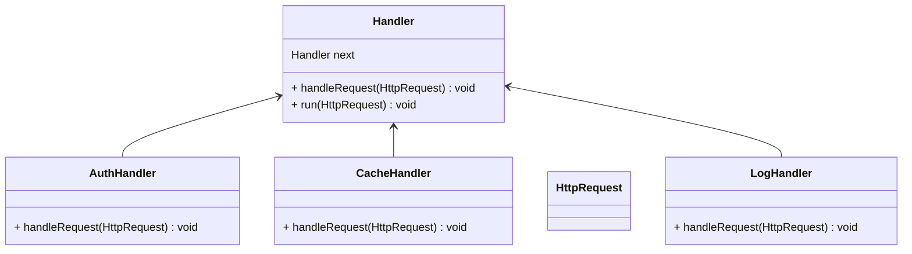

> 이미지 출처 : [refactoring.guru](https://refactoring.guru/design-patterns/chain-of-responsibility)

'책임 연쇄 패턴'이란 순차적으로 진행되어야할 일련의 작업들이 있을때 적용할 수 있는 [[행동 디자인 패턴]] 중 하나이다. 이를 통해서 하나의 객체에서 하나의 작업만 수행하게 하며 [[단일 책임 원칙|(단일 책임 원칙)]], 적용할 작업들을 유연하게 추가/ 삭제 할 수 있다.

# 책임 연쇄 패턴
만약 요청으로부터 인증/인가를 처리한다고 가정해보자.

> 이미지 출처 : [refactoring.guru](https://refactoring.guru/design-patterns/chain-of-responsibility)

```java
public void processRequest(HttpRequest request) {
 // Authentication
 checkAuthentication(request);
 // Authorization
 checkAuthorization(request); 
}
```

여기서 요구사항의 변경으로 '인증/인가' 외에 사용자 정보를 캐싱하기로 했다.
```java
public void processRequest(HttpRequest request) {
 // 인증
 checkAuthentication(request);
 // 인가
 checkAuthorization(request); 

  // 사용자라면
  if (checkRole(request) == ROLE.USER) {
    // 캐싱
    caching(request);  
  }
}
```

또 여기서 요구사항의 추가로, 관리자의 요청이라면 로그를 따로 남기기로 했다.

```java
public void processRequest(HttpRequest request) {
 // 인증
 checkAuthentication(request);
 // 인가
 checkAuthorization(request); 

  // 사용자라면
  if (checkRole(request) == ROLE.USER) {
    // 캐싱
    caching(request);  
  } else if (checkRole(request) == ROLE.ADMIN) {
    logging(request);
  }
}
```

이처럼 여러가지의 기능이 추가될 수록 분기가 생기고 복잡도가 올라간다.

> 이미지 출처 : [refactoring.guru](https://refactoring.guru/design-patterns/chain-of-responsibility)

이렇게 계속 기능이 추가된다면 소프트웨어는 수많은 분기로 코드들의 역할이 섞이며 유지보수 하기 힘들정도로 복잡해질 것이다.

이럴때 해결책으로 '책임 연쇄 패턴'을 사용한다.

> 이미지 출처 : [refactoring.guru](https://refactoring.guru/design-patterns/chain-of-responsibility)

핸들러들이 각각의 임무(인증, 인가, 캐싱, 로깅)를 수행하고 다음 임무로 넘길지 말지 결정을 내릴 수 있다.

### 장점
- 핸들러마다 하나의 책임만 가지므로 [[단일 책임 원칙]]을 준수한다.
- 동적으로 유연하게 핸들러의 순서를 변경할 수 있다.
- 작업이 중간 핸들러에서 끝났으면, 이후 핸들러를 실행 안할수도 있다.

### 구조

추상 `Handler` 클래스를 만들고, 이를 상속하는 각각의 핸들러를 구현하는 구조로 되어 있다.
하나의 작업이 끝나면, 필드로 선언된 `next`(다음 핸들러)로 작업을 넘길지 결정할 수 있다.

## 코드로
### 핸들러
```java
abstract class Handler {  
  protected Handler next;  
  
  public Handler setNext(Handler next) {  
    this.next = next;  
    return next;  
  }  
  
  public abstract void handleRequest(HttpRequest request);  
  
  public void run(HttpRequest request) {  
    handleRequest(request);  
  
    if (this.next != null) {  
      this.next.run(request);  
    }  
  }  
}
```

#### 핸들러 구현체들
```java
public class AuthHandler extends Handler {  
  
  @Override  
  public void handleRequest(HttpRequest request) {  
    System.out.println("인증 작업...");  
  }  
}
```

```java
public class CacheHandler extends Handler {  
  
  @Override  
  public void handleRequest(HttpRequest request) {  
    System.out.println("캐싱 작업....");  
  }  
}
```

```java
public class LogHandler extends Handler {  
  
  
  @Override  
  public void handleRequest(HttpRequest request) {  
    System.out.println("로깅 작업....");  
  }  
}
```

### 핸들러 실행 예시
```java
Handler requestHandler = new AuthHandler();  
requestHandler  
    .setNext(new CacheHandler())  
    .setNext(new LogHandler());  
  
requestHandler.run(httpRequest);
```


#### 실행 결과
```bash
인증 작업...
캐싱 작업....
로깅 작업....
```

## 실제 도입 사례
[Spring Security](https://github.com/spring-projects/spring-security)의 Filter Chain


